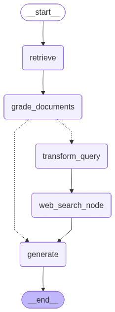

# CRAG: Corrective Retrieval-Augmented Generation System

## Workflow Graph

  

---

## AWS Deployment Screenshot

  

  

---

## Setup

### 1. Clone the Repository
git clone (https://github.com/thanusri1601/Corrective-RAG-System-for-Knowledge-Retrieval.git)  
cd CRAG-System

---

### 2. Create Virtual Environment
python3 -m venv venv  
source venv/bin/activate  

---

### 3. Install Dependencies
pip install --upgrade pip  
pip install -r requirements.txt  

---

## Running the Application

### Local Execution
streamlit run app.py  

---

## AWS EC2 Deployment

This project is deployed on an AWS EC2 Ubuntu instance.

### Deployment Steps
1. Launch an Ubuntu EC2 instance  
2. Open port 8501 in the EC2 security group  
3. Clone this repository on the EC2 instance  
4. Create and activate a Python virtual environment  
5. Install required dependencies  
6. Run the Streamlit application  

Run the application on EC2 using:
streamlit run app.py --server.port 8501 --server.address 0.0.0.0  

## Live Deployment
http://ec2-3-91-215-180.compute-1.amazonaws.com:8501/

## Output

- Interactive Streamlit-based user interface  
- Corrective Retrieval-Augmented Generation workflow  
- Reduced hallucinations through validation and corrective retrieval  
- Publicly accessible AWS EC2 deployment  

---

## Technologies Used

- Python  
- LangChain  
- LangGraph  
- FAISS Vector Store  
- OpenAI API  
- Streamlit  
- AWS EC2  

---

## Key Contributions

- Implemented Corrective Retrieval-Augmented Generation (CRAG) to improve factual grounding  
- Designed an agent-based workflow using LangGraph  
- Introduced validation and corrective retrieval to mitigate hallucinations  
- Deployed an end-to-end LLM system on AWS EC2  

---

## Author

Thanusri A  

